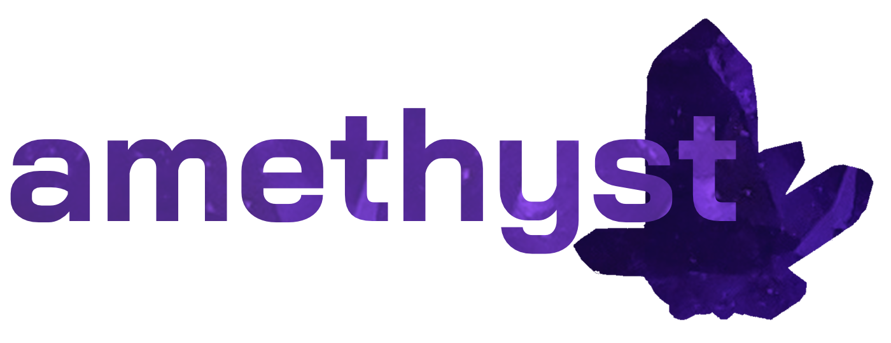

Amethyst is a extension/plugin for the InfiltrationEngine. Currently features an Attributes Editor with extra support for custom hacks and a Network Map visualizer.

Amethyst is licensed under Apache 2.0.
Iris, the library used for the UI in Amethyst is licensed under MIT.
## Attributes Editor
Amethyst has an easy to use attributes editor built in. Access the Attributes Editor, then click an instance with Attributes and the attributes on that instance will be listed. You can now freely adjust and edit the attributes from that list and it will update on it's own. Do note decimals and attributes that need multiple lines (StateScripts & CustomBehavior) are currently not supported and likely will not ever be.

Some things such as Custom Hacks will recieve special support, such as extra visualization. Currently, CustomHacks are the only one that have extra support, with it having icon visualization, network resource & detection risk bars.

## Network Map
Toggles on/off the network map. This maps out your mission's network in the workspace by creating lines to represent links between nodes, alongside showing information on the nodes itself.
